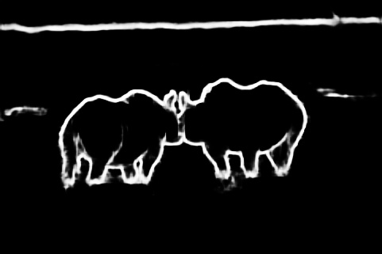
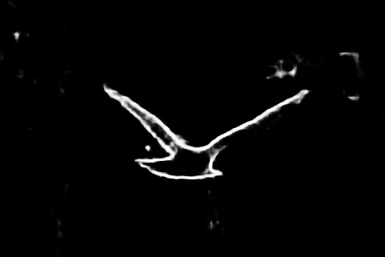
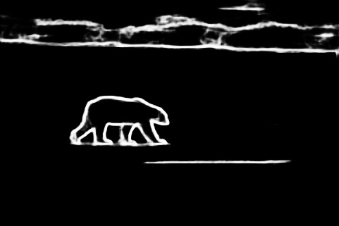
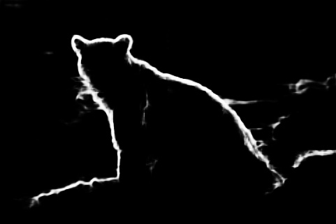
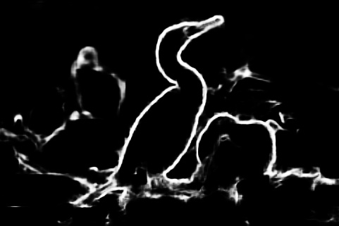

# holistically-nested edge detection (HED)
*Implemented in pytorch*

*[Paper](https://arxiv.org/abs/1504.06375)*

## requirement:
* scipy
* torch
* opencv-python

***fine-tuned from vgg-16-bn***

## output of test

